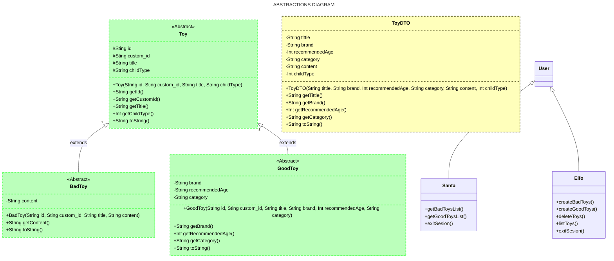
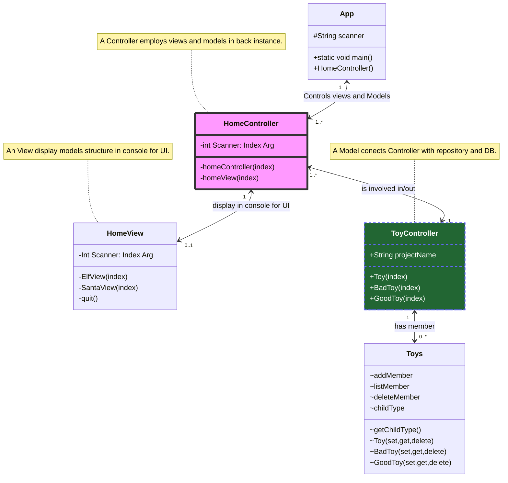
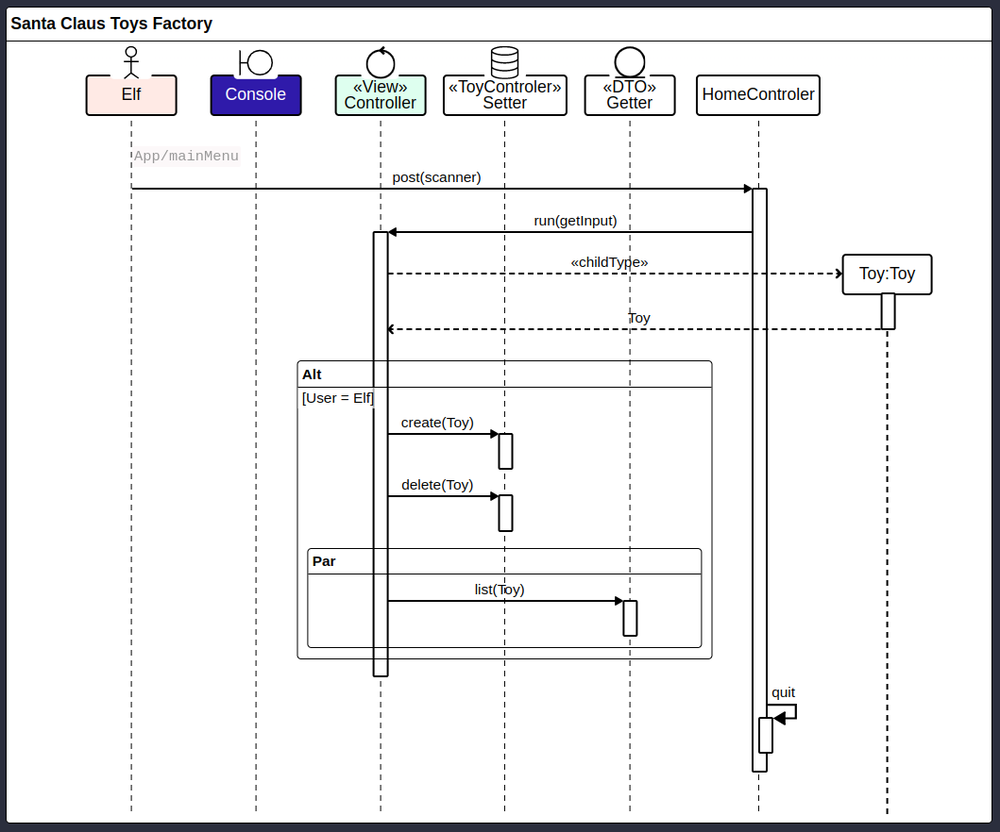

# [SANTA CLAUS TOYS FACTORY](https://github.com/ofiucoder/My_PJSCTF)
Java-Project


# My_PJSCTF

## Descripción


Santa Claus top Factory es una aplicación desarrollada en Java que utiliza la consola como interfaz de usuario desde donde se van a integrar los datos utilizando la metodologia (MVC) Modelo, Vista, Controlador.

Los usuarios contaran con dos perfiles Santa o Elfo para realizar las tareas requeridas. la administración y el ingreso de los juguetes; con distintas funcionalidades para crear, leer, filtrar y eliminar registros de acuerdo a los requerimientos del Usuario.

Si la aplicación es utilizada por Santa entonces podrá obtener la lista de juguetes para niños buenos o la lista de juguetes para niños malos. También tendrá la posibilidad de guardar la lista completa de todos los juguetes en formato .csv.


##Objetivo
Acercarnos poco a poco la arquitectura clásica de Spring Boot. Aplicar el patrón de arquitectura MVC (Model-View-Controller) para estructurar la aplicación. Entender y aplicar el patrón repositorio y la inversión de dependencias.


## Descripción con SIPNOSIS del proyecto 

### Planificación del proyecto

>    1. Se realizo la planificacion utilizando [Jira](https://albertocasasofiuco-1730202167115.atlassian.net/jira/software/projects/PJSCTF/boards/5/backlog)
>    2. El projecto fue bajo el nombre  [My_PJSCTF](https://github.com/ofiucoder/My_PJSCTF)
>    3. Los diagramas se encuentran en un el archivo [projectoInsideOut.drawio](https://drive.google.com/file/d/1NVHUrTjYrLSpKclKpEaub4_o8r0NiPPG/view?usp=drive_link)

### Realización de Diagramas

>    - Clases
>    - Historia de Usuario
>    - Modelo Vista Controlador (MVC)


## Pre Requisitos (Que se necesita instalar para poder ejecutar el proyecto) 

>- Java 21
>- Maven
>    · Hamcrest (Dependencia)
>- Extensiones (VSC) - Visual Studio Code

>    · **Extension Pack for Java** del editor Microsoft <sup>este instalará los que aparecen a continuación</sup>


>        1. Language Support for Java(TM) by Red Hat
>        2. Debugger for Java
>        3. Test Runner for Java
>        4. Maven for Java
>        5. Gradle for Java
>        6. Project Manager for Java 
>        7. IntelliCode

>  - JUnit5 JAR Downloader extensión by Raj Kundu
>
>      

>

## Pasos para la instalación 

De las URL que aparecen a continuación realizar las descargas de los paquetes correspondientes a los programas (Java 21, Apache Maven, VSC - Visual Studio Code) en este caso Java en la versión 21

### Java 21


- Windows

    https://www.oracle.com/es/java/technologies/downloads/#java21 (jdk 21)
    https://download.oracle.com/java/21/latest/jdk-21_windows-x64_bin.exe (sha256)

- Mac

    https://download.oracle.com/java/21/latest/jdk-21_macos-x64_bin.dmg (sha256) (ojo procesador)
+
    https://formulae.brew.sh/formula/maven#default

#### Configuración variables de entorno windows


## Ejecución del test (Capturas de cobertura) 

## Diagramas Realizados 

  - DIAGRAMA DE CLASES

    


## DIAGRAMA DE CLASES


  - HISTORIAS DE USUARIOS

    


    

>    ```mermaid
>zenuml
>title Santa Claus Toys Factory
>@Actor Elf #FFEBE6
>@Boundary Console #0747A6
>@Control <<View>> Controller #E3FCEF
>group Model {
>  @database <<ToyControler>> Setter
>  @entity <<DTO>>Getter
>}
>
>@Starter(Elf)
>// `App/mainMenu`
>HomeControler.post(scanner) {
>  Controller.run(getInput) {
>    Toy = new Toy(childType)
>    if(User = Elf) {
>        Setter.create(Toy)
>        Setter.delete(Toy)      
>      par {
>        Getter.list(Toy)
>      }      
>    }
>  }
>  quit
>}
>    
>    ```

    
  - 

## Autor:  

- Alberto Casas [@ofiucoder](https://github.com/ofiucoder)
