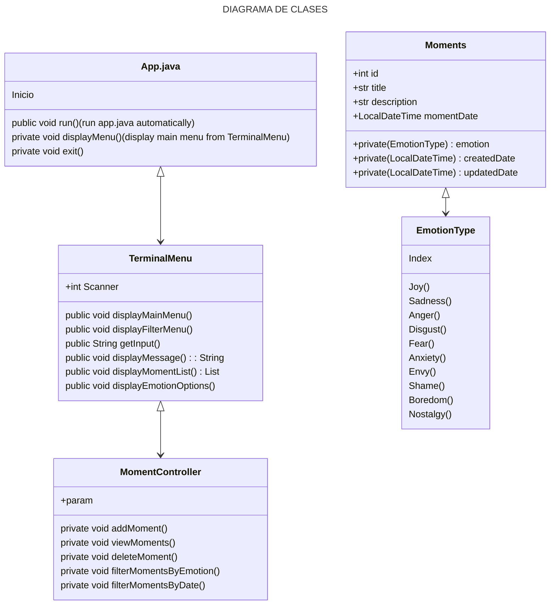

# My_PJSCTF

# Java-Project-Santa-Claus-Toys-Factory


##Instrucciones
OH! OH! OH! Santa Claus necesita tu ayuda developer!!! Para estas navidades Santa a decidido renovar su sistema de gestión de juguetes y dejar de lado la creación manual de largos pergaminos. Pero OJO! el sistema se comportará de manera distinta dependiendo de si lo usa Santa o uno de sus elfos y el sistema de almacenamiento de los datos va ser distinto en función de si el juguete es para niños buenos o si es un juguete para niños malos.

Se os ha encargado la creación de una aplicación de consola que permitirá a los elfos de Santa registar los juguetes creados, listar el inventario y suprimir juguetes.

Si la aplicación es utilizada por Santa entonces podrá obtener la lista de juguetes para niños buenos o la lista de juguetes para niños malos. También deberá tener la posibilidad de guardar la lista completa de todos los juguetes en formato .csv.


##Objetivo
Acercarnos poco a poco la arquitectura clásica de Spring Boot. Aplicar el patrón de arquitectura MVC (Model-View-Controller) para estructurar la aplicación. Entender y aplicar el patrón repositorio y la inversión de dependencias.


## Descripción con SIPNOSIS del proyecto 

### Planificación del proyecto

>    1. Se realizo la planificacion utilizando [Jira](https://albertocasasofiuco-1730202167115.atlassian.net/jira/software/projects/PJSCTF/boards/5/backlog)
>    2. El projecto fue bajo el nombre  [projectjavaSantaClausTosysFactory](https://albertocasasofiuco-1730202167115.atlassian.net/jira/software/projects/JPIO/boards/2)
>    3. Los diagramas se encuentran en un el archivo [projectoInsideOut.drawio](https://drive.google.com/file/d/1NVHUrTjYrLSpKclKpEaub4_o8r0NiPPG/view?usp=drive_link)

### Realización de Diagramas

>    - Clasesh
>    - Historia de Usuario
>    - Modelo Vista Controlador (MVC)


## Pre Requisitos (Que se necesita instalar para poder ejecutar el proyecto) 

>- Java 21
>- Maven
>    · Hamcrest (Dependencia)
>- Extensiones (VSC) - Visual Studio Code

>    · **Extension Pack for Java** del editor Microsoft <sup>este instalará los que aparecen a continuación</sup>


>        1. Language Support for Java(TM) by Red Hat
>        2. Debugger for Java
>        3. Test Runner for Java
>        4. Maven for Java
>        5. Gradle for Java
>        6. Project Manager for Java 
>        7. IntelliCode

>  - JUnit5 JAR Downloader extensión by Raj Kundu
>
>      

>

## Pasos para la instalación 

De las URL que aparecen a continuación realizar las descargas de los paquetes correspondientes a los programas (Java 21, Apache Maven, VSC - Visual Studio Code) en este caso Java en la versión 21

### Java 21


- Windows

    https://www.oracle.com/es/java/technologies/downloads/#java21 (jdk 21)
    https://download.oracle.com/java/21/latest/jdk-21_windows-x64_bin.exe (sha256)

- Mac

    https://download.oracle.com/java/21/latest/jdk-21_macos-x64_bin.dmg (sha256) (ojo procesador)
+
    https://formulae.brew.sh/formula/maven#default

#### Configuración variables de entorno windows


## Ejecución del test (Capturas de cobertura) 

## Diagramas Realizados 

  - DIAGRAMA DE CLASES

    


    
  - HISTORIAS DE USUARIOS

    


    

>    ```mermaid
>    zenuml
>    title Moment Emotion Controller
>    @Actor Riley #FFEBE6
>    @Boundary TerminalMenu #0747A6
>    @control <<Moment>> Controller #E3FCEF
>    group MomentContoller {
>      @database Setter
>      @entity Getter
>    }
>
>    @Starter(Riley)
>    // `App/mainMenu`
>    TerminalMenu.post(scanner) {
>      Controller.run(getInput) {
>        moment = new Moment(EmotionType)
>        if(EmotionType != null) {
>          par {
>            Setter.create(moment)
>            Setter.update(moment)
>            Getter.view(moment)
>            Getter.filter(moment)
>            Setter.delete(moment)      
>          }      
>        }
>      }
>    }
>    
>    ```
>

    
  - MODELO VISTA CONTROLADOR

    

## Autor:  

- Alberto Casas [@ofiucoder](https://github.com/ofiucoder)
